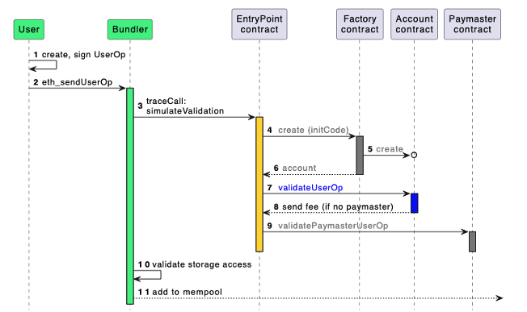

## Components
**V06**
- [Bundler](https://github.com/eth-infinitism/bundler/tree/releases/0.6.0)
- [EntryPoint + Factory](https://github.com/eth-infinitism/account-abstraction/tree/releases/v0.6)
- [Paymaster contract](https://github.com/pimlicolabs/erc20-paymaster)
## Interaction schema (simplified)

Source: https://www.erc4337.io/docs/understanding-ERC-4337/architecture

## Deploy smart contracts

#### EP+Factory
Clone repo
```
git clone https://github.com/eth-infinitism/account-abstraction.git
git checkout origin/releases/v0.6
```
**Pitfall: comment out line 14 at `deploy/2_deploy_SimpleAccountFactory.ts`**
Add 'custom' network to `hardhat.config.ts`
Deploy and verify
```
yarn && yarn preprocess
yarn add @nomicfoundation/hardhat-verify
npx hardhat deploy --network custom --simple-account-factory
npx hardhat verify --network custom <address>
```

#### Paymaster contract
Clone repo
```
git clone https://github.com/pimlicolabs/erc20-paymaster.git
```
Deploy and verify
```
forge create SingletonPaymasterV6 --rpc-url <https://rpc> --private-key 8f6...f093e --constructor-args <EPAddress> <signerAddress> --legacy --verify --verifier blockscout --verifier-url <explorer api-url>
```
## Run bundler

Put mnemonic to
`packages/bundler/localconfig/mnemonic.txt`
Clone and run
```
git clone https://github.com/eth-infinitism/bundler.git
cd bundler
yarn run bundler --network <https://node_rpc> --unsafe --entryPoint <entryPoint> --port 4337
```
## Links

Catalog of useful resources https://github.com/4337Mafia/awesome-account-abstraction
